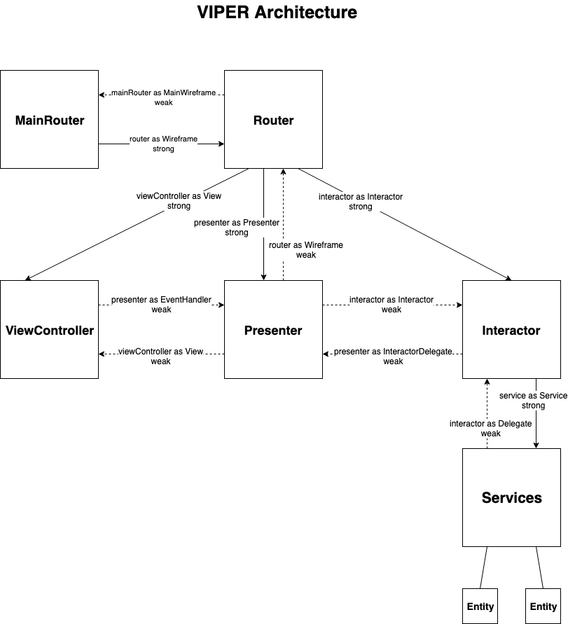
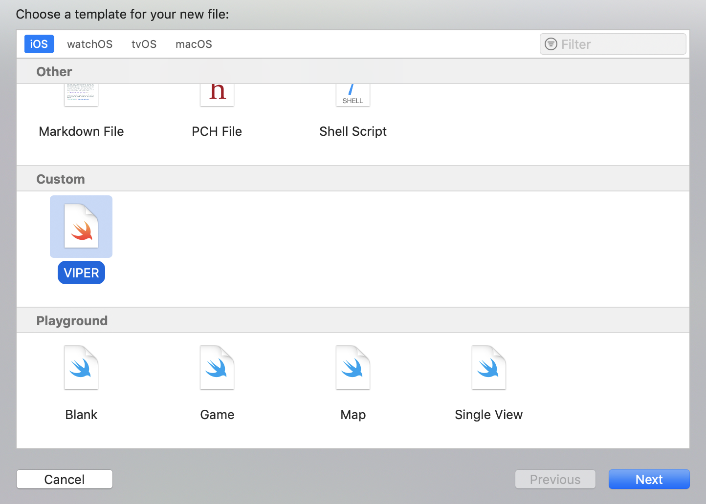

# ViperBase
This is base project that provides a starting point for an application that uses VIPER architecture.
Also includes a template for Xcode that generates the files for VIPER modules.

<p align="center">

</p>

# Install Xcode file templates
1. Download <a href="Xcode File Template/VIPER.xctemplate">VIPER.xctemplate</a>

Clone or download and unzip the repository

2. Create a new folder for the custom file template
```
cd ~/Library/Developer/Xcode/Templates/File\ Templates/Custom/
```
_Note: if the folder in path is already exists you should proceed to step 3._

3. Copy the file template
```
cp ~/Downloads/Xcode\ File\ Template/VIPER.xctemplate/ ~/Library/Developer/Xcode/ ~/Library/Developer/Xcode/Templates/File\ Templates/Custom/
```
4. Open Xcode and start using the new template
<p align="center">

</p>
